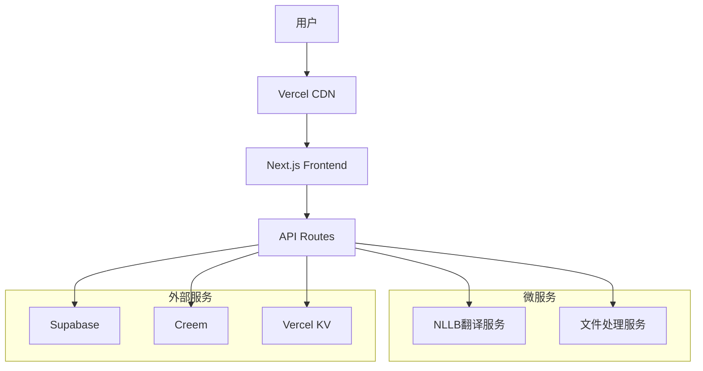

# 🌍 Loretrans - 专业小语种翻译平台

> 让每种语言都能被理解，让每个声音都能被听见

[](https://github.com/your-repo/loretrans)
[](LICENSE)
[](https://github.com/your-repo/loretrans/actions)
[](https://loretrans.app/api/health)

## 📋 目录

- [项目概述](#项目概述)
- [功能特性](#功能特性)
- [技术架构](#技术架构)
- [快速开始](#快速开始)
- [开发指南](#开发指南)
- [API文档](#api文档)
- [部署指南](#部署指南)
- [贡献指南](#贡献指南)

## 🎯 项目概述

Loretrans 是一个专注于小语种翻译的AI驱动平台，基于Meta NLLB模型，专门解决Google翻译等主流工具无法处理的语言翻译需求。

### 🌟 核心价值

- **专业小语种支持**: 覆盖海地克里奥尔语、老挝语、缅甸语等20+种小语种
- **高准确率**: 基于Meta NLLB模型，翻译准确率超过90%
- **成本优势**: 比人工翻译节省99%成本，比主流API便宜80%
- **用户友好**: 500字符内完全免费，注册即送500积分

### 👥 目标用户

- **学术研究者**: 翻译小语种学术文献和研究资料
- **移民群体**: 处理官方文件、法律文档翻译
- **跨境电商**: 产品描述本地化，进入小语种市场
- **NGO工作者**: 多语种沟通和文档处理
- **语言学习者**: 学习材料翻译和语言练习

## ✨ 功能特性

### 🔥 核心功能

#### 文本翻译
- ✅ 支持20+种小语种双向翻译
- ✅ 500字符内完全免费
- ✅ 实时字符计数和积分预估
- ✅ 智能语言检测
- ✅ 一键复制和语音播放
- ✅ 翻译历史保存

#### 文档翻译
- ✅ 支持PDF、Word、PPT格式
- ✅ 保持原文档格式
- ✅ 批量文档处理
- ✅ 文档大小限制：免费5MB，付费50MB

#### 用户系统
- ✅ 邮箱注册/登录
- ✅ 社交登录（Google、GitHub）
- ✅ 用户控制台和积分管理
- ✅ 翻译历史和使用统计
- ✅ 个性化设置和偏好

#### 积分系统
- ✅ 基于字符数的灵活计费
- ✅ 多层级定价套餐
- ✅ 新用户奖励和推荐奖励
- ✅ 积分永不过期
- ✅ 透明的费用预估

#### 支付系统
- ✅ Creem支付集成
- ✅ 支持信用卡、借记卡
- ✅ 安全的PCI DSS合规处理
- ✅ 即时充值到账
- ✅ 完整的支付记录

### 🎨 用户体验

#### 响应式设计
- ✅ 完美适配桌面、平板、手机
- ✅ 移动端专门优化
- ✅ 触摸友好的交互设计
- ✅ 暗色模式支持

#### 多语言界面
- ✅ 支持中文、英文、法文等界面语言
- ✅ 基于用户偏好自动切换
- ✅ 完整的本地化支持

#### 用户引导
- ✅ 新用户欢迎流程
- ✅ 功能演示和教程
- ✅ 个性化设置向导
- ✅ 智能套餐推荐

### 🔧 技术特性

#### 性能优化
- ✅ 翻译结果缓存
- ✅ 图片和资源优化
- ✅ 代码分割和懒加载
- ✅ CDN加速

#### 安全保障
- ✅ 输入验证和清理
- ✅ SQL注入防护
- ✅ XSS和CSRF防护
- ✅ 速率限制和防滥用

#### 监控告警
- ✅ 健康检查API
- ✅ 服务状态监控
- ✅ 错误日志收集
- ✅ 性能指标追踪

## 🏗️ 技术架构

### 前端技术栈
```
Next.js 14+          # React框架
TypeScript           # 类型安全
Tailwind CSS         # 样式框架
Radix UI             # 组件库
React Hook Form      # 表单处理
Zustand              # 状态管理
React Query          # 数据获取
```

### 后端技术栈
```
Next.js API Routes   # API服务
Supabase             # 数据库和认证
Meta NLLB            # 翻译引擎
Creem                # 支付处理
Vercel KV            # 缓存服务
Resend               # 邮件服务
```

### 基础设施
```
Vercel               # 部署和托管
Supabase             # 数据库服务
Docker               # 容器化
GitHub Actions       # CI/CD
Cloudflare           # CDN和安全
```

### 架构图



## 🚀 快速开始

### 环境要求

- Node.js 18+
- Python 3.8+
- Docker (可选)
- Git

### 1. 克隆项目

```bash
git clone https://github.com/your-repo/loretrans.git
cd loretrans
```

### 2. 环境配置

```bash
# 复制环境变量模板
cp frontend/.env.example frontend/.env.local

# 编辑环境变量
nano frontend/.env.local
```

必需的环境变量：
```env
# Supabase
NEXT_PUBLIC_SUPABASE_URL=your_supabase_url
NEXT_PUBLIC_SUPABASE_ANON_KEY=your_supabase_anon_key
SUPABASE_SERVICE_ROLE_KEY=your_service_role_key

# Creem支付
CREEM_API_KEY=your_creem_api_key

# NLLB服务
NLLB_SERVICE_URL=http://localhost:8081

# 文件处理服务
FILE_PROCESSOR_URL=http://localhost:8082
```

### 3. 一键启动

```bash
# 使用增强版启动脚本
./start-dev-enhanced.sh
```

或者手动启动：

```bash
# 安装依赖
cd frontend && npm install && cd ..

# 启动NLLB服务
cd microservices/nllb-local
python app.py &

# 启动文件处理服务
cd ../file-processor
python app.py &

# 启动前端
cd ../../frontend
npm run dev
```

### 4. 访问应用

- 🌐 前端: http://localhost:3000
- 🤖 NLLB服务: http://localhost:8081
- 📄 文件处理: http://localhost:8082
- 🔍 健康检查: http://localhost:3000/api/health

## 💻 开发指南

### 项目结构

```
loretrans/
├── frontend/                 # Next.js前端应用
│   ├── app/                 # App Router页面
│   ├── components/          # React组件
│   ├── lib/                 # 工具库和配置
│   └── public/              # 静态资源
├── microservices/           # 微服务
│   ├── nllb-local/         # NLLB翻译服务
│   └── file-processor/     # 文件处理服务
├── supabase/               # 数据库迁移
│   └── migrations/         # SQL迁移文件
├── docs/                   # 项目文档
├── scripts/                # 构建和部署脚本
└── docker-compose.yml      # Docker配置
```

### 开发工作流

#### 1. 功能开发

```bash
# 创建功能分支
git checkout -b feature/new-feature

# 开发和测试
npm run dev
npm run test

# 提交代码
git add .
git commit -m "feat: add new feature"
git push origin feature/new-feature
```

#### 2. 代码规范

```bash
# 代码检查
npm run lint

# 类型检查
npm run type-check

# 格式化代码
npm run format

# 运行测试
npm run test
```

#### 3. 数据库迁移

```bash
# 创建新迁移
supabase migration new migration_name

# 应用迁移
supabase db push

# 重置数据库
supabase db reset
```

### 组件开发指南

#### 创建新组件

```typescript
// components/example/example-component.tsx
'use client'

import { useState } from 'react'
import { Button } from '@/components/ui/button'

interface ExampleComponentProps {
  title: string
  onAction?: () => void
}

export function ExampleComponent({ title, onAction }: ExampleComponentProps) {
  const [loading, setLoading] = useState(false)

  const handleClick = async () => {
    setLoading(true)
    try {
      await onAction?.()
    } finally {
      setLoading(false)
    }
  }

  return (
    <div className="p-4 border rounded-lg">
      <h3 className="text-lg font-semibold mb-2">{title}</h3>
      <Button onClick={handleClick} disabled={loading}>
        {loading ? '处理中...' : '执行操作'}
      </Button>
    </div>
  )
}
```

#### API路由开发

```typescript
// app/api/example/route.ts
import { NextRequest, NextResponse } from 'next/server'
import { createClient } from '@supabase/supabase-js'

export async function POST(request: NextRequest) {
  try {
    const { data } = await request.json()
    
    // 验证输入
    if (!data) {
      return NextResponse.json(
        { error: '缺少必需参数' },
        { status: 400 }
      )
    }
    
    // 处理业务逻辑
    const result = await processData(data)
    
    return NextResponse.json({ result })
  } catch (error) {
    console.error('API错误:', error)
    return NextResponse.json(
      { error: '服务器内部错误' },
      { status: 500 }
    )
  }
}
```

### 测试指南

#### 单元测试

```typescript
// __tests__/components/example-component.test.tsx
import { render, screen, fireEvent } from '@testing-library/react'
import { ExampleComponent } from '@/components/example/example-component'

describe('ExampleComponent', () => {
  it('renders correctly', () => {
    render(<ExampleComponent title="测试标题" />)
    expect(screen.getByText('测试标题')).toBeInTheDocument()
  })

  it('handles click events', async () => {
    const mockAction = jest.fn()
    render(<ExampleComponent title="测试" onAction={mockAction} />)
    
    fireEvent.click(screen.getByText('执行操作'))
    expect(mockAction).toHaveBeenCalled()
  })
})
```

#### 集成测试

```typescript
// __tests__/api/example.test.ts
import { createMocks } from 'node-mocks-http'
import handler from '@/app/api/example/route'

describe('/api/example', () => {
  it('handles POST requests', async () => {
    const { req, res } = createMocks({
      method: 'POST',
      body: { data: 'test' }
    })

    await handler(req, res)
    expect(res._getStatusCode()).toBe(200)
  })
})
```

## 📚 API文档

### 认证

所有需要认证的API都使用Bearer Token：

```bash
Authorization: Bearer <supabase_jwt_token>
```

### 翻译API

#### POST /api/translate

翻译文本内容

**请求体:**
```json
{
  "text": "Hello, how are you?",
  "source_language": "en",
  "target_language": "ht"
}
```

**响应:**
```json
{
  "translated_text": "Bonjou, kijan ou ye?",
  "character_count": 18,
  "credits_used": 0,
  "translation_time": 1200
}
```

### 用户API

#### GET /api/user/credits

获取用户积分余额

**响应:**
```json
{
  "credits": 1500,
  "tier": "basic",
  "usage_stats": {
    "total_translations": 45,
    "total_characters": 12500
  }
}
```

#### POST /api/user/credits/purchase

购买积分

**请求体:**
```json
{
  "plan_id": "basic",
  "payment_method": "card"
}
```

### 健康检查API

#### GET /api/health

系统健康状态检查

**响应:**
```json
{
  "status": "healthy",
  "timestamp": "2025-01-03T10:00:00Z",
  "services": {
    "database": {
      "status": "available",
      "responseTime": 45
    },
    "nllb": {
      "status": "available",
      "responseTime": 120
    }
  },
  "uptime": 86400,
  "memory": {
    "used": 256,
    "total": 512,
    "percentage": 50
  }
}
```

## 🚀 部署指南

### Vercel部署（推荐）

#### 1. 准备工作

```bash
# 安装Vercel CLI
npm i -g vercel

# 登录Vercel
vercel login
```

#### 2. 环境变量配置

在Vercel Dashboard中设置环境变量：

```env
NEXT_PUBLIC_SUPABASE_URL=your_supabase_url
NEXT_PUBLIC_SUPABASE_ANON_KEY=your_supabase_anon_key
SUPABASE_SERVICE_ROLE_KEY=your_service_role_key
CREEM_API_KEY=your_creem_api_key
NLLB_SERVICE_URL=your_nllb_service_url
```

#### 3. 部署

```bash
# 部署到生产环境
vercel --prod

# 或者通过Git自动部署
git push origin main
```

### Docker部署

#### 1. 构建镜像

```bash
# 构建所有服务
docker-compose build

# 启动服务
docker-compose up -d
```

#### 2. 生产环境配置

```bash
# 使用生产配置
docker-compose -f docker-compose.yml -f docker-compose.prod.yml up -d
```

### 自定义服务器部署

#### 1. 服务器准备

```bash
# 安装依赖
sudo apt update
sudo apt install nodejs npm python3 python3-pip nginx

# 安装PM2
npm install -g pm2
```

#### 2. 应用部署

```bash
# 克隆代码
git clone https://github.com/your-repo/loretrans.git
cd loretrans

# 安装依赖
cd frontend && npm ci && npm run build
cd ../microservices/nllb-local && pip install -r requirements.txt
cd ../file-processor && pip install -r requirements.txt

# 启动服务
pm2 start ecosystem.config.js
```

#### 3. Nginx配置

```nginx
server {
    listen 80;
    server_name your-domain.com;

    location / {
        proxy_pass http://localhost:3000;
        proxy_http_version 1.1;
        proxy_set_header Upgrade $http_upgrade;
        proxy_set_header Connection 'upgrade';
        proxy_set_header Host $host;
        proxy_cache_bypass $http_upgrade;
    }

    location /api/translate {
        proxy_pass http://localhost:8081;
        proxy_set_header Host $host;
        proxy_set_header X-Real-IP $remote_addr;
    }
}
```

## 🔧 运维指南

### 监控和日志

#### 健康检查

```bash
# 检查服务状态
curl https://your-domain.com/api/health

# 检查特定服务
curl http://localhost:8081/health
curl http://localhost:8082/health
```

#### 日志查看

```bash
# 查看应用日志
tail -f logs/frontend.log
tail -f logs/nllb.log
tail -f logs/file-processor.log

# Docker日志
docker-compose logs -f frontend
docker-compose logs -f nllb-service
```

### 性能优化

#### 缓存策略

```typescript
// 翻译结果缓存
const cacheKey = `translation:${sourceText}:${sourceLang}:${targetLang}`
const cachedResult = await redis.get(cacheKey)

if (cachedResult) {
  return JSON.parse(cachedResult)
}

// 执行翻译并缓存结果
const result = await translateText(sourceText, sourceLang, targetLang)
await redis.setex(cacheKey, 3600, JSON.stringify(result))
```

#### 数据库优化

```sql
-- 添加索引
CREATE INDEX idx_translations_user_created ON translations(user_id, created_at);
CREATE INDEX idx_credit_transactions_user_type ON credit_transactions(user_id, type);

-- 清理过期数据
DELETE FROM guest_sessions WHERE expires_at < NOW() - INTERVAL '7 days';
```

### 备份和恢复

#### 数据库备份

```bash
# Supabase备份
supabase db dump > backup_$(date +%Y%m%d).sql

# 恢复备份
supabase db reset
psql -h your-db-host -U postgres -d postgres < backup_20250103.sql
```

#### 文件备份

```bash
# 备份上传文件
tar -czf uploads_backup_$(date +%Y%m%d).tar.gz uploads/

# 备份配置文件
tar -czf config_backup_$(date +%Y%m%d).tar.gz .env* *.config.js
```

## 🤝 贡献指南

### 贡献流程

1. **Fork项目** - 点击GitHub上的Fork按钮
2. **创建分支** - `git checkout -b feature/amazing-feature`
3. **提交更改** - `git commit -m 'Add amazing feature'`
4. **推送分支** - `git push origin feature/amazing-feature`
5. **创建PR** - 在GitHub上创建Pull Request

### 代码规范

#### 提交信息格式

```
type(scope): description

feat(auth): add social login support
fix(translate): resolve character encoding issue
docs(readme): update installation guide
style(ui): improve button hover effects
refactor(api): optimize translation service
test(unit): add user authentication tests
chore(deps): update dependencies
```

#### 代码风格

- 使用TypeScript进行类型安全
- 遵循ESLint和Prettier配置
- 组件使用PascalCase命名
- 函数使用camelCase命名
- 常量使用UPPER_SNAKE_CASE命名

### 问题报告

使用GitHub Issues报告问题，请包含：

- 问题描述和重现步骤
- 期望行为和实际行为
- 环境信息（浏览器、操作系统等）
- 相关截图或错误日志

### 功能请求

提交功能请求时请说明：

- 功能的使用场景和价值
- 详细的功能描述
- 可能的实现方案
- 是否愿意参与开发

## 📄 许可证

本项目采用 MIT 许可证 - 查看 [LICENSE](LICENSE) 文件了解详情。

## 🙏 致谢

- [Meta NLLB](https://github.com/facebookresearch/fairseq/tree/nllb) - 提供强大的多语言翻译模型
- [Supabase](https://supabase.com/) - 提供数据库和认证服务
- [Vercel](https://vercel.com/) - 提供部署和托管服务
- [Next.js](https://nextjs.org/) - 提供优秀的React框架
- [Tailwind CSS](https://tailwindcss.com/) - 提供实用的CSS框架

## 📞 联系我们

- 📧 邮箱: support@loretrans.app
- 🌐 网站: https://loretrans.app
- 📱 Twitter: [@LoretransApp](https://twitter.com/LoretransApp)
- 💬 Discord: [Loretrans Community](https://discord.gg/loretrans)

---

<div align="center">
  <p>Made with ❤️ by the Loretrans Team</p>
  <p>让每种语言都能被理解 🌍</p>
</div>
