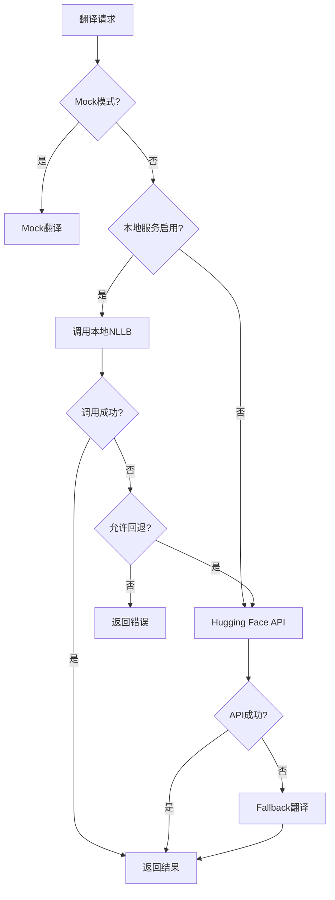

# NLLB 600M 本地化部署完整指南

本指南将帮助你在Transly项目中部署NLLB 600M模型的本地推理服务，实现高性能的本地翻译功能。

## 📋 目录

- [概述](#概述)
- [系统要求](#系统要求)
- [快速开始](#快速开始)
- [详细配置](#详细配置)
- [Docker部署](#docker部署)
- [集成到主服务](#集成到主服务)
- [性能优化](#性能优化)
- [监控和维护](#监控和维护)
- [故障排除](#故障排除)

## 📋 概述

NLLB (No Language Left Behind) 600M是Meta开发的多语言翻译模型，支持200+语言。本方案提供：

- ✅ **本地推理**：无需外部API调用，数据更安全
- ✅ **高性能**：优化的批处理和缓存机制
- ✅ **可扩展**：支持Docker容器化部署
- ✅ **备用机制**：自动切换到Hugging Face API
- ✅ **多语种支持**：完整支持Transly的20+小语种

## 🔧 系统要求

### 最低要求
- **CPU**: 4核心以上
- **内存**: 4GB RAM（推荐8GB+）
- **存储**: 5GB可用空间（模型+依赖）
- **网络**: 下载模型时需要稳定网络

### 推荐配置
- **CPU**: 8核心Intel/AMD或苹果M1/M2
- **内存**: 8GB+ RAM
- **GPU**: 可选，NVIDIA GPU可显著提升性能
- **存储**: SSD存储提升模型加载速度

### 软件要求
- Node.js 18+
- npm 或 yarn
- Docker (可选，用于容器化部署)

## 🚀 快速开始

### 方法一：自动设置脚本（推荐）

```bash
# 1. 进入项目目录
cd microservices/nllb-local

# 2. 运行设置脚本
./setup.sh

# 3. 启动服务
npm start
```

### 方法二：手动设置

```bash
# 1. 安装依赖
cd microservices/nllb-local
npm install

# 2. 配置环境变量
cp .env.example .env
# 编辑 .env 文件配置参数

# 3. 下载模型
npm run download-model

# 4. 启动服务
npm start
```

### 验证部署

```bash
# 健康检查
curl http://localhost:8080/health

# 测试翻译
curl -X POST http://localhost:8080/translate \
  -H "Content-Type: application/json" \
  -d '{"text":"Hello world","sourceLanguage":"en","targetLanguage":"ht"}'
```

## ⚙️ 详细配置

### 环境变量配置

在 `microservices/nllb-local/.env` 文件中配置：

```env
# 服务配置
PORT=8080                    # 服务端口
HOST=0.0.0.0                # 绑定地址
NODE_ENV=production          # 运行环境

# 模型配置
MODEL_PATH=./models/nllb-600m    # 本地模型路径
DEVICE=cpu                       # 计算设备: cpu/gpu
DTYPE=fp32                       # 精度: fp32/fp16
BATCH_SIZE=4                     # 批处理大小

# 性能调优
MAX_CONCURRENT_REQUESTS=10       # 最大并发请求
REQUEST_TIMEOUT=30000           # 请求超时(ms)
```

### 主服务集成配置

在项目根目录的 `.env` 文件中添加：

```env
# NLLB本地服务配置
NLLB_LOCAL_ENABLED=true              # 启用本地服务
NLLB_LOCAL_URL=http://localhost:8080 # 本地服务地址
NLLB_LOCAL_FALLBACK=true             # 允许回退到云服务
NLLB_LOCAL_TIMEOUT=30000            # 超时时间
```

## 🐳 Docker部署

### 使用Docker Compose（推荐）

```bash
# 1. 进入Docker目录
cd microservices/nllb-local/docker

# 2. 启动服务
docker-compose up -d

# 3. 查看状态
docker-compose ps
docker-compose logs nllb-local
```

### 手动Docker部署

```bash
# 构建镜像
docker build -f microservices/nllb-local/docker/Dockerfile \
  -t nllb-local microservices/nllb-local/

# 运行容器
docker run -d \
  --name nllb-local-service \
  -p 8080:8080 \
  -e DEVICE=cpu \
  -e BATCH_SIZE=4 \
  nllb-local
```

## 🔗 集成到主服务

本地NLLB服务已自动集成到Transly主服务中。集成逻辑：

1. **优先使用本地服务**：如果启用且可用
2. **自动回退**：本地服务故障时回退到Hugging Face API
3. **Mock模式**：开发环境无API Key时使用mock数据

### 服务调用流程



## ⚡ 性能优化

### 硬件优化

```env
# GPU加速（需要NVIDIA GPU + CUDA）
DEVICE=gpu
DTYPE=fp16    # GPU上使用半精度

# CPU优化
BATCH_SIZE=8  # 多核CPU可增加批处理
```

### 内存优化

```env
# 减少内存使用
BATCH_SIZE=2
DTYPE=fp16

# 模型缓存设置
MODEL_CACHE_SIZE=1
```

### 网络优化

```bash
# 使用CDN镜像下载模型（中国用户）
export HF_ENDPOINT=https://hf-mirror.com
npm run download-model
```

## 📊 监控和维护

### 健康检查

```bash
# 基础健康检查
curl http://localhost:8080/health

# 详细服务信息
curl http://localhost:8080/model/info
```

### 日志监控

```bash
# Docker环境
docker logs nllb-local-service -f

# 本地环境
tail -f microservices/nllb-local/logs/app.log
```

### 性能监控

```bash
# 系统资源使用
htop
nvidia-smi  # GPU使用（如有）

# 服务性能测试
npm run test
```

## 🔄 维护操作

### 更新模型

```bash
# 清理旧模型
npm run download-model cleanup

# 重新下载
npm run download-model

# 重启服务
docker-compose restart nllb-local
```

### 备份和恢复

```bash
# 备份模型文件
tar -czf nllb-model-backup.tar.gz microservices/nllb-local/models/

# 恢复模型
tar -xzf nllb-model-backup.tar.gz
```

## 🛠️ 故障排除

### 常见问题

#### 1. 内存不足错误
```
Error: Cannot allocate memory
```
**解决方案**：
- 增加系统RAM或减少 `BATCH_SIZE`
- 使用 `DTYPE=fp16` 减少内存使用
- 关闭其他应用程序释放内存

#### 2. 模型下载失败
```
Error: Failed to download model
```
**解决方案**：
- 检查网络连接
- 使用国内镜像：`export HF_ENDPOINT=https://hf-mirror.com`
- 手动下载并放置到指定目录

#### 3. GPU不被识别
```
Warning: GPU not available, using CPU
```
**解决方案**：
- 安装NVIDIA驱动和CUDA
- 确认 `nvidia-smi` 可用
- 安装GPU版本的依赖

#### 4. 端口占用
```
Error: Port 8080 already in use
```
**解决方案**：
```bash
# 查找占用进程
lsof -i :8080
# 修改端口
export PORT=8081
```

### 调试模式

```env
# 启用详细日志
LOG_LEVEL=debug

# 启用性能分析
ENABLE_METRICS=true
```

### 重置服务

```bash
# 完全重置
cd microservices/nllb-local
rm -rf models downloads logs .env
./setup.sh
```

## 📈 性能基准

不同配置下的性能表现：

| 硬件配置 | 单次翻译延迟 | 批量翻译(10条) | 内存使用 | 吞吐量(req/s) |
|----------|-------------|----------------|----------|---------------|
| 4核CPU, 8GB RAM | ~500ms | ~2s | ~3GB | ~2 |
| 8核CPU, 16GB RAM | ~300ms | ~1s | ~3GB | ~3-4 |
| NVIDIA RTX 3080 | ~100ms | ~300ms | ~4GB | ~10 |
| Apple M2 Pro | ~200ms | ~600ms | ~3GB | ~5 |

## 🔐 安全考虑

### API安全
```env
# 启用API密钥验证
API_KEY=your-secure-api-key

# 限制访问来源
ALLOWED_ORIGINS=https://yourdomain.com,http://localhost:3000
```

### 网络安全
- 仅在内网部署，不要暴露到公网
- 使用防火墙限制访问端口
- 定期更新依赖和系统补丁

## 📞 技术支持

如果遇到问题：

1. 查看本文档的故障排除章节
2. 检查服务日志：`docker logs nllb-local-service`
3. 运行诊断测试：`npm test`
4. 查看GitHub Issues获取已知问题

---

## 📝 更新日志

- **v1.0.0** - 初始版本发布
- 支持NLLB 600M模型本地推理
- 集成到Transly主服务
- 支持Docker容器化部署

---

*本指南涵盖了NLLB本地部署的完整流程。如有问题，请参考故障排除章节或联系技术支持。* 